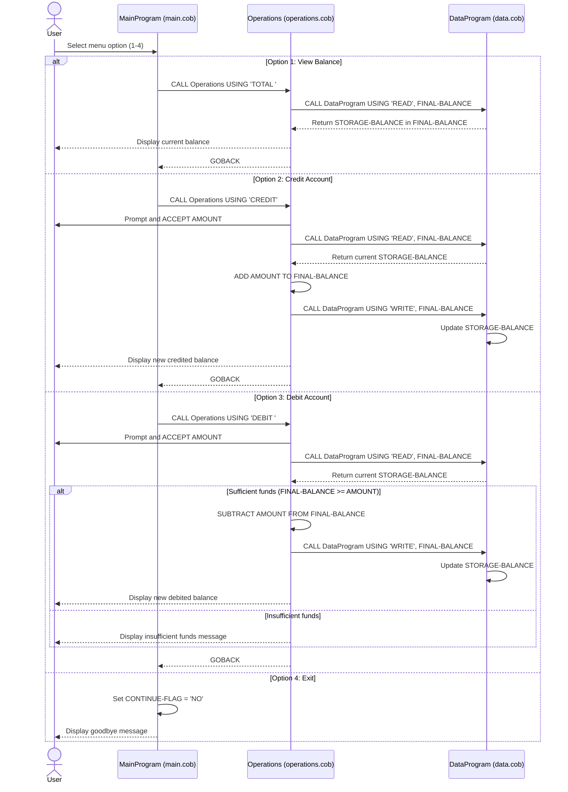

# COBOL Student Account System Documentation

## Overview
This project is a small modular COBOL account management system for a student account balance.
It is split into three programs:
- A main menu controller
- An operations processor
- A data storage module

The current implementation works with a single in-memory account balance and provides menu-based actions to:
- View total balance
- Credit funds
- Debit funds

## File Purposes

### src/cobol/main.cob (MainProgram)
Purpose:
- Entry point for the application.
- Displays and loops through the menu.
- Routes user actions to the operations module.

Key behavior:
- Repeats until the user selects Exit.
- Accepts choices 1-4.
- Calls `Operations` with operation codes:
  - `TOTAL ` for viewing balance
  - `CREDIT` for adding funds
  - `DEBIT ` for subtracting funds
- Prints an invalid choice message for unsupported inputs.

### src/cobol/operations.cob (Operations)
Purpose:
- Handles business operations on the student account.
- Reads/writes balance through `DataProgram`.

Key behavior:
- Receives operation type from `MainProgram`.
- `TOTAL `:
  - Reads balance from `DataProgram` and displays it.
- `CREDIT`:
  - Prompts for an amount.
  - Reads current balance.
  - Adds amount.
  - Writes updated balance.
  - Displays new balance.
- `DEBIT `:
  - Prompts for an amount.
  - Reads current balance.
  - Checks whether sufficient funds exist.
  - If yes, subtracts amount and writes new balance.
  - If no, rejects transaction with an insufficient funds message.

### src/cobol/data.cob (DataProgram)
Purpose:
- Encapsulates account balance storage and data access.
- Provides a simple read/write interface for other modules.

Key behavior:
- Maintains `STORAGE-BALANCE` in working storage.
- Receives operation commands via linkage:
  - `READ` returns current balance.
  - `WRITE` persists a provided balance.

## Student Account Business Rules
The following business rules are currently implemented:

1. Single-account scope:
- The program manages one balance value for one student account context.

2. Starting balance:
- The stored balance starts at 1000.00.

3. Credit rule:
- Crediting always increases the account balance by the entered amount.

4. Debit rule with protection:
- Debits are only allowed when current balance is greater than or equal to the requested amount.
- If funds are insufficient, balance is unchanged.

5. Menu validation:
- Only options 1-4 are accepted.
- Any other value triggers a user-facing validation message.

## Module Interaction Flow
1. User selects a menu option in `MainProgram`.
2. `MainProgram` calls `Operations` with a command code.
3. `Operations` calls `DataProgram`:
- `READ` to fetch current balance.
- `WRITE` to persist changes after successful credit/debit.
4. Control returns to `MainProgram` for the next user choice.

## Notes and Current Limitations
- Balance is stored in memory only; data is not persisted externally.
- Input validation for amount format/sign is minimal.
- No student identifier is modeled; the logic applies to a single account state.

## Sequence Diagram (Data Flow)

